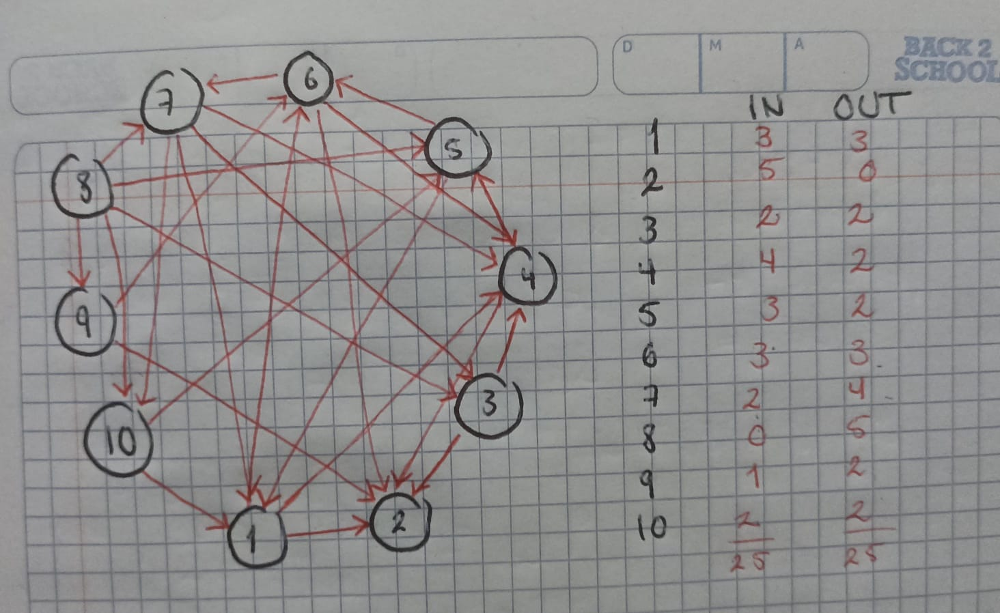
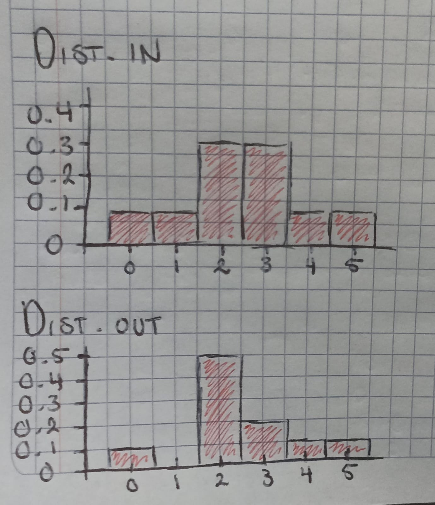
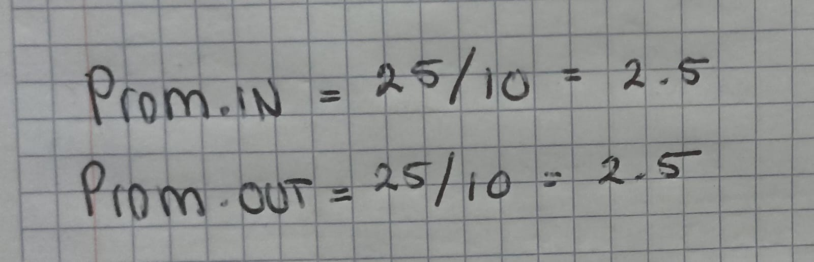
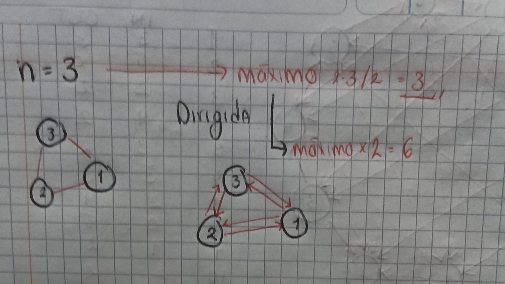
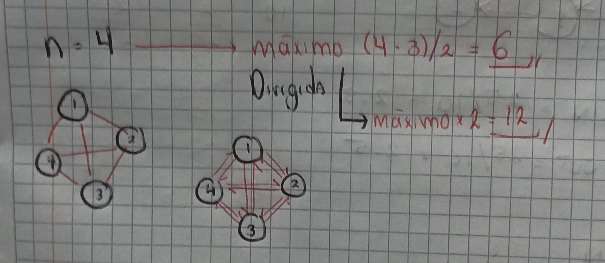
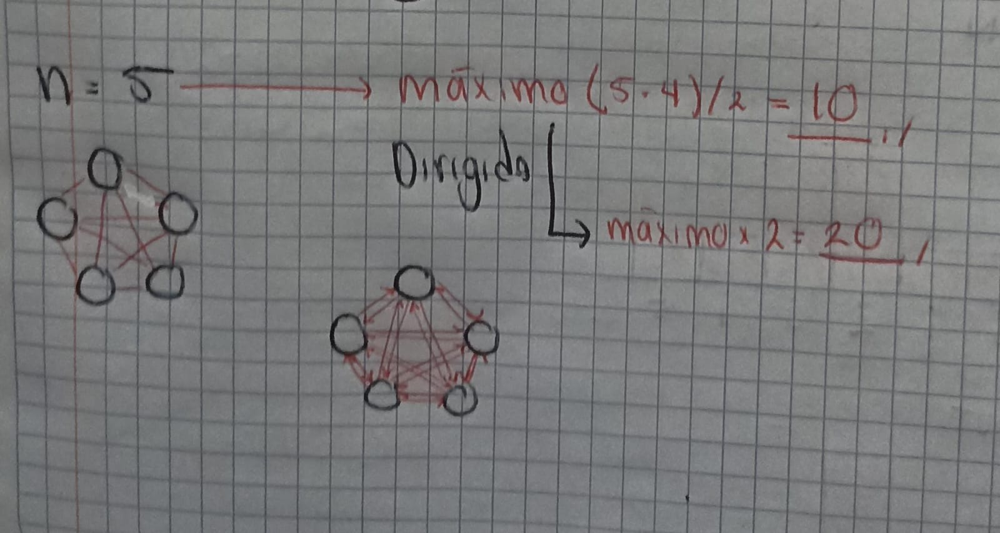
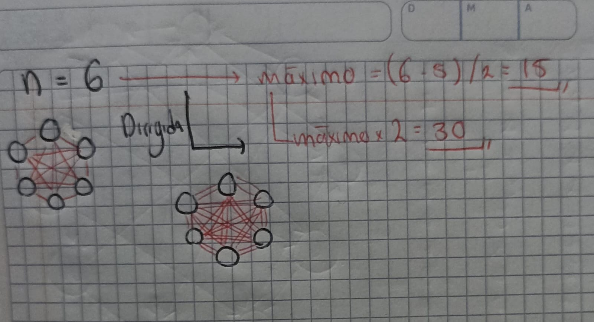
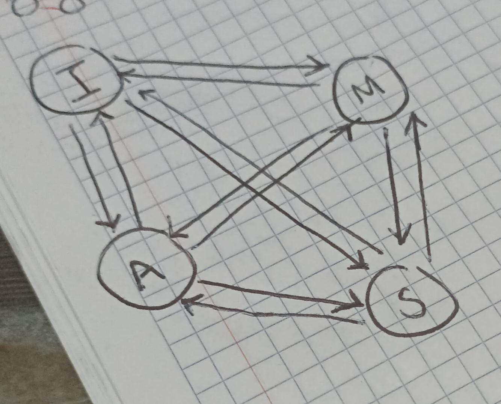

```{r setup, include=FALSE}
knitr::opts_chunk$set(echo = TRUE, warning = FALSE, message = FALSE)
library(igraph)
```

## Preguntas Rapidas

**1. Considera una red de 15 nodos. Considera que tienes una sola conexión. ¿Cuál es el número máximo de nodos que puedes conectar? Dado un solo nodo , ¿cuál es el número máximo conexiones que puede tener tal nodo?**

El numero maximo de nodos que puedes conectar con una sola conexion son 2, ya que una conexion no direccionada o direccionada describe la interaccion o relacion entre 2 nodos, mientras que, dado un solo nodo este puede tener un maximo de 1 conexion si trabajamos con una conexion, pero su numero maximo de conexiones sin esta condicional sera el numero de nodos que pertenecen a la red y no son este mismo nodo, ya que, si solo consideramos las caracteristicas de una red normal, este puede conectarse con cualquier otro nodo, por lo que seria el numero maximo de nodos de la red -1.

**2. Considera una red dirigida de 10 nodos. Usa 25 conexiones y dibuja una red con ese número de nodos y conexiones dirigidas. Calcula la distribución de conectividades de salida.Calcula el número total de conexiones de salida ¿Cómo se compara el número total de de conectividades de entrada (son iguales, diferentes)? Explica tu respuesta. Calcula el promedio de entrada y de salida. Discute tu resultado.**



Posteriormente para calcular la distribucion de conexiones se utiliza la tabla anterior que tiene el numero de conexiones de entrada y salida para cada nodo, de tal forma que se estima por numero de conexion la frecuencia relativa (ej, para 3 conexiones de entrada hay una frecuencia de 3 de 10 nodos, por lo que su frecuencia relativa es 0.3)



El numero total de conectividad de entrada y salida es el mismo, esto debido a que las conexiones son las mismas, una conexion entre nodo A y B con direccion A hacia B tendra el mismo valor de entrada y salida, una conexion de entrada y una de salida, una conexion siempre representara una conexion de entrada y una de salida, por lo que la suma de las conexiones de entrada y salida siempre sera la misma, aun cuando la distribucion no es igual, esto debido a que es independiente que nodos se conectan entre ellos y cuales seran conexiones de entrada y de salida para cada nodo.



El promedio de conexiones es el mismo por la misma razon.

**3. Considera una red no dirigida de n = 3, 4, 5, 6 nodos respectivamente. ¿Cuál es el número máximo de conexiones que puedes poner? Dibuja cada caso. ¿Qué pasa si la red es dirigida?**

En general, en las redes no dirigidas la forma de estimar el numero maximo de conexiones es n(n-1)/2. Mientras que en las dirigidas es el doble de la estimacion anterior.














**4. Considera tu red de amigos reales.¿ Cuál es tu coeficiente de clusterización?**

```{r}
g<-read.csv("../Data/adjacency_matrix.csv")
rownames(g)<-g[,1]
g<-g[,-1]
g<-as.matrix(g)
diag(g)<-0
red<-graph_from_adjacency_matrix(g)
plot(red,vertex.size=15,vertex.size=5,
     edge.arrow.size=0.25,layout=layout_nicely,vertex.size.label=0.25)
```

Tengo 3 amigos con conexion dirigida de entrada y salida, entonces como mis 3 amigos tienen el maximo numero de conexiones dirigidas: 6, entonces mi coeficiente de cluster es de 1. 


## Scripts, código, texto y gráficas

### 1. Propiedades básicas de redes

**red A**

• Número de conexiones = 9

• Número de nodos = 10

• Degree = 1:2, 2:3, 3:2, 4:3, 5:1, 6:3, 7:1, 8:1, 9:1, 10:1

• Average degree = 1.8

• Degree distribution = 0.5 para 1, 0.2 para 2, 0.3 para 3.

• Density = 0.18.

• Adjacency matrix

• Matriz de distancia

• Diámetro = 5

• Nodos más distantes = 5 y 9.

• Coeficiente de clusterización = 0.

**red B**

• Número de conexiones = 9

• Número de nodos = 10

• Degree = 1:5, 2:1, 3:1, 4:4, 5:1, 6:1, 7:1, 8:2, 9:1, 10:1

• Average degree = 1.8

• Degree distribution 0.7 para 1, 0.1 para 2, 0 para 3, 0.1 para 4 y 0.1 para 5.

• Density = 0.09

• Adjacency matrix

• Matriz de distancia

• Diámetro = 3

• Nodos más distantes = 10 y 4

• Coeficiente de clusterización = 0

**red C**

• Número de conexiones = 45

• Número de nodos = 10

• Degree = 1:9, 2:9, 3:9, 4:9, 5:9, 6:9, 7:9, 8:9, 9:9, 10:9

• Average degree = 9

• Degree distribution = 1 para 9

• Density = 0.9

• Adjacency matrix

• Matriz de distancia

• Diámetro = 1

• Nodos más distantes = 1 y 2

• Coeficiente de clusterización = 1

**red D**

• Número de conexiones = 30

• Número de nodos = 10

• Degree = 1:6, 2:5, 3:5, 4:6, 5:5, 6:6, 7:4, 8:6, 9:7, 10:10

• Average degree = 6

• Degree distribution = 0.1 para 4, 0.3 para 5, 0.4 para 6, 0.1 para 7, 0.1 para 10

• Density = 0.3

• Adjacency matrix

• Matriz de distancia

• Diámetro = 3

• Nodos más distantes = 1 y 2

• Coeficiente de clusterización 0.637795

**red E**

• Número de conexiones = 13

• Número de nodos = 10

• Degree = 1:3, 2:1, 3:2, 4:2, 5:1, 6:2, 7:5, 8:4, 9:2, 10:4

• Average degree = 2.6

• Degree distribution = 0.2 para 1, 0.4 para 2, 0.1 para 3, 0.2 para 4 y 0.1 para 5

• Density = 0.26

• Adjacency matrix

• Matriz de distancia

• Diámetro = 4

• Nodos más distantes = 2 y 4

• Coeficiente de clusterización = 0.2068

**red F**

• Número de conexiones = 9

• Número de nodos = 10

• Degree = 1:2, 2:3, 3:3, 4:3, 5:2, 6:1, 7:1, 8:1, 9:1, 10:1

• Average degree = 1.8

• Degree distribution = 0.5 para 1, 0.2 para 2 y 0.3 para 3

• Density = 0.09

• Adjacency matrix

• Matriz de distancia

• Diámetro = 3

• Nodos más distantes = 1 y 8

• Coeficiente de clusterización = 0

Script en R para hacer las matrices

```{r}
## A

gA <- make_empty_graph(10, directed = FALSE)
gA <- add_edges(gA, c(1,2, 2,3, 2,4, 4,6, 6,9, 6,10, 4,8, 3,5, 1,7))
plot(gA)

## B

gB <- make_empty_graph(n = 10, directed = TRUE)
gB <- add_edges(gB, c(2,1,5,1,3,1,6,1,4,1,7,4,9,4,8,4,10,8))
plot(gB)

## C

gC <- make_full_graph(10, directed = FALSE)
plot(gC)

## D

gD <- make_empty_graph(10, directed = TRUE)
gD <- add.edges(gD, c(4,3,9,3,1,3,6,3,2,6,10,6,4,6,6,8,7,8,1,8,8,7,5,7,7,1,5,1,10,1,4,1,10,5,2,5,4,2,9,2,4,10,2,10,5,10,8,10,9,10,3,10,4,9,10,9,8,9,6,9))
plot(gD)

## E

gE <- make_empty_graph(10, directed = FALSE)
gE <- add_edges(gE, c(5,7,2,7,3,7,1,3,7,1,8,7,1,10,8,9,8,10,8,6,10,4,6,4,9,10))
plot(gE)

## F

gF <- make_empty_graph(10, directed = TRUE)
gF <- add_edges(gF, c(4,8,4,9,2,4,2,5,5,10,1,2,1,3,3,6,3,7))
plot(gF)

# Funcion para calculo de valores

Red_propiedades <- function(red, directed = FALSE){
  if(directed == FALSE){
    total <- (length(V(red))*(length(V(red)-1)))/2
  } else if(directed == TRUE){
    total <- ((length(V(red))*(length(V(red)-1)))/2)*2
  }
  x <- list()
for (i in 1:10) {
  x[i] <- shortest_paths(red, i)
}
dist <- c()
nombres <- c()
for (i in 1:10) {
  for (j in 1:10) {
    dist <- c(dist, length(x[[i]][[j]]))
    nombres <- c(nombres, paste(i, "y", j))
  }
}
dist
names(dist) <- nombres
dist

## Los nodos mas alejados entonces son:
sort(dist, decreasing = TRUE)[1]
  res <- list(
    No_conexiones = length(E(red)),
    No_nodos = length(V(red)),
    Degree = degree(red),
    Average_degree = mean(degree(red)),
    Degreee_distribution = degree.distribution(red),
    Densidad = length(E(red))/total,
    Matriz_adyacente = as.matrix(get.adjacency(red)),
    Matriz_distancia = distances(red),
    Diametro = diameter(red),
    Nodos_mas_lejanos = sort(dist, decreasing = TRUE)[1],
    Coeficiente_cluster = transitivity(red, type = "local")
  )
  return(res)
}

Red_propiedades(gA)

Red_propiedades(gB, directed = TRUE)

Red_propiedades(gC)

Red_propiedades(gD, directed = TRUE)

Red_propiedades(gE)

Red_propiedades(gF, directed = TRUE)
```
### 2. Karate

```{r}
karate <- make_graph("Zachary")
karate
plot(karate)
```
• ¿Cuántos nodos y conexiones tiene?

Tiene 78 conexiones y 34 nodos.

• ¿Quiénes son los nodos y cuál es la regla de conexión?

Los nodos son estudiantes del club de karate de Zachary, mientras que los nodos se conectan segun si hay interaccion afuera del club entre los estudiantes.

• ¿Qué tan densa es la red?

Poco densa, teniendo un maximo de 578 conexiones posibles entre nodos, pero unicamente tiene 78 conexiones, por lo que tiene una densidad de 0.1349.

• ¿Cómo obtienes la matriz de adyacencia?

La matriz de adyacencia se obtiene representando las conexiones con numeros (1) y la falta de conexion entre nodos con (0).

```{r}
Red_propiedades(karate)$Matriz_adyacente
```


• ¿Es una red dirigida, pesada?

Es una red no dirigida y sin peso.

• Calcula y gráfica la distribución de conectividades

```{r}
hist(sort(Red_propiedades(karate)$Degree), probability = TRUE, main = "Distribucion de conectividades Karate", xlab = "Degree")
```


• Calcula el diámetro, la matriz de distancias y la distancia promedio

```{r}
# Diametro

Red_propiedades(karate)$Diametro

# Matriz de distancias

Red_propiedades(karate)$Matriz_distancia

# Promedio de distancias

mean(Red_propiedades(karate)$Matriz_distancia)
```

• Encuentra la trayectoria de los nodos más alejados.

```{r}
sort(Red_propiedades(karate)$Matriz_distancia, decreasing = TRUE)[1:20]

## Hay 16 nodos con distancia de 5 como maximo.

mat <- Red_propiedades(karate)$Matriz_distancia

row.names(mat) <- colnames(mat) <- c(1:34)

dist5 <- which(mat == 5, arr.ind = TRUE)
dist5

# Ahora tenemos que eliminar aquellos pares duplicados, se va a hacer con un ciclo for anidado.

x <- 0
for(i in 1:16){
  for (j in i:16) {
    if(dist5[i,][1] == dist5[j,][2] & dist5[i,][2] == dist5[j,][1]){
      x <- c(x, j)
    }
  }
}
x
dist5 <- dist5[-c(x),]

# Finalmente extraemos los row y col names para saber que nodos son
pares_dist_5 <- data.frame(
  Nodo_1 = rownames(mat)[dist5[, 1]],
  Nodo_2 = colnames(mat)[dist5[, 2]],
  distancia = mat[dist5]
)

pares_dist_5
```

• Existen nodos con coefeiciente de clusterización 1. ¿Qué significa?

Significa que los nodos a los que ellos estan conectados tienen el maximo de conexiones posibles entre ellos, ej. un nodo con conexion a 3 nodos tienen 3 conexiones entre ellos, el cual es el numero maximo de conexiones. En el contexto de esta red significa que los estudiantes con los que interactua el individuo A interactuan a su vez entre ellos.

• Mide , con al menos tres medidas de centralidad, los nodos más importantes.

Primero centralidad de grado.

```{r}
degree(karate, V(karate)[1])

degree(karate, V(karate)[34])
```
Posteriormente el betweenness que mide cuantas veces un nodo actua como un puente a lo largo del camino mas corto de otros nodos.

```{r}
betweenness(karate, V(karate)[1])

betweenness(karate, V(karate)[34])
```
Y finalmente la centralidad de proximidad, que mide cuan cerca esta un nodo de los otros nodos de la red.

```{r}
closeness(karate, V(karate)[1])

closeness(karate, V(karate)[34])
```

### 3. Amigos 

```{r}
plot(red)
```

Funcion para calcular numero de amigos de una persona arbitraria y comparar con el numero de amigos de sus amigos.

```{r}
amigos <- function(Red, nombre){
  amiwos <- c()
for (i in 1:length(neighbors(Red,nombre))) {
  amiwos <- c(amiwos, length(neighbors(Red,(neighbors(Red,nombre, mode = "out")[i]), mode = "out")))
}
  if(length(neighbors(Red,nombre)) >= sum(amiwos)/length(amiwos)){
    y <- paste(nombre, "tiene mas amigos que el promedio de sus amigos")
  } else{
    y <- paste(nombre, "tiene menos amigos que el promedio de sus amigos")
  }
  x <- list(
    Amigos = neighbors(Red,nombre),
    Amigos_de_amigos = amiwos,
    Promedio_amigos = sum(amiwos)/length(amiwos),
    tienes_mas_o_menos_que_el_promedio = y
  )
  return(x)
}

## Ej.

amigos(red, "MIGUEL")
amigos(red, "IVAN")
```
Funcion para camino mas largo entre dos nodos especificos

```{r}
Dist_larga <- function(red, Nodo1, Nodo2, all = FALSE){
  distl <- all_simple_paths(red, from = Nodo1, to = Nodo2)
  long <- (sapply(distl, length))
  mas_larga <- sort(long, decreasing = TRUE)[1]
  res <- distl[which(long == mas_larga)]
  if(all == FALSE){
    return(res[1])
  } else if (all == TRUE){
    return(res)
  }
}

# La mas larga tiene 17 pasos, pero en realidad hay varias con esta distancia, si queremos ver todas tenemos que especificar que all = TRUE
Dist_larga(red, "MIGUEL", "LUIS")

length(Dist_larga(red, "MIGUEL", "LUIS", all = TRUE))

# Como podemos ver hay 5420 posibles caminos con distancia 17 por lo que no lo voy a imprimir pero ya se hace una idea.
```
Las dos personas mas populares

```{r}
sort(degree(red), decreasing = TRUE)[c(1,2)]
```
### Red PPI

```{r}
library(igraphdata)

data("yeast")

class(yeast)

## Distribucion de conexiones

yeast_p <- Red_propiedades(yeast)

# Primero en el eje de las x asignamos los valores de degree que se presentan en la red.
x <- as.numeric(names((table(yeast_p$Degree))))

# Y despues en el eje de las y asignamos en orden las frecuencias obtenidas para cada valor de degree
y <- sort((table(yeast_p$Degree)), decreasing = TRUE)

# log log, vamos a graficar los ejes antes calculados con su respectivo logaritmo en cada eje.

plot(log(x), log(y), xlab = "Log(degree)", ylab = "Log(Frecuencia)", main = "Distribución de conectividades Proteína-Proteína (log-log)")
```
10 proteinas mas conectadas

```{r}
sort(degree(yeast), decreasing = TRUE)[c(1:10)]
```
Diamentro 

```{r}
yeast_p$Diametro
```
Promedio de distancias

```{r}
mean(yeast_p$Matriz_distancia)

is.connected(yeast)

# Esto significa que dentro del grafo yeast hay subgrafos conectados entre si por edges pero que no tienen conexion entre ellos, por lo que, si queremos hacer el calculo de matriz de distancias entre nodos tenemos que hacerlo unicamente dentro de los subgrafos, ya que si no obtendremos infinito como respuesta ya que no es posible la conexion entre nodos de diferentes subgrafos.

components <- components(yeast) # Aqui estamos extrayendo los componentes del grafo principal, de tal forma que estos componentes estan compuestos por los nodos conectados entre si, osea los subgrafos.

media <- c()

# Vamos a realizar un ciclo for para calcular la media de distancias en cada subgrafo que tenga mas de 1 nodo perteneciente.

for (i in 1:(sort(components$membership, decreasing = TRUE)[1])) { # Aqui estamos haciendo que el ciclo for itere hasta el componente mas alto en el vector con la mayor cantidad de nodos en el calculo de componentes, es decir, encontramos aquel vector de componentes con la mayor cantidad de nodos y de ahi extraemos el componente mas grande que contiene para que se itere hasta el, de tal forma que pase por todos los componentes creados.
  nodos <- which(components$membership == i) # Aqui estamos obteniendo los nodos que pertenecen al componente i.
  subgrafo <- induced.subgraph(yeast, nodos) # Aqui creamos un subgrafo que contiene solo los nodos seleccionados por el componente.
  if (gorder(subgrafo) > 1) { ## Aqui estamos condicionando el la iteracion del ciclo para que solo continue si el subgrafo generado tiene mas de 1 nodo. 
    mdist <- distances(subgrafo) # calculamos la matriz de distancias del subgrafo.
    media <- c(media, mean(mdist[mdist < Inf])) # calculamos la media omitiendo aquellos valores que podriamos tener un valor de infinito.
  }
}

media

## Estas son las medias de las distancias en aquellos subgrafos generados con mas de 1 nodo que los compone.
```
Funcion para elimiar nodos

```{r, eval=FALSE}
Robustness <- function(red, numero_nodos){
  inter <- as.character(c(V(red))) 
  res <- list(
    Nodo_removido = c(rep(0, (numero_nodos + 1))),
    Diametro = c(diameter(red), rep(0, numero_nodos)),
    distancia_media = c(
      mean(media), ## Voy a utilizar la media de las medias de los subgrafos con mas de 1 nodo para evitar hacer listas de listas
      rep(0, numero_nodos)
    )
  )
  for (i in 1:numero_nodos){
    x <- sample(inter, 1)
    inter <- inter[inter != x]
    red <- delete.vertices(red, V(red)$x)
    components <- components(red)
    media2 <- c()
    for (j in unique(components$membership)){
      nodos <- which(components$membership == j)
      subgrafo <- induced.subgraph(red, nodos) 
      if (gorder(subgrafo) > 1) { 
        mdist <- distances(subgrafo)
        media2 <- c(media2, mean(mdist[mdist < Inf]))
      }
    }
    res[[1]][(i + 1)] <- x 
    res[[2]][(i + 1)] <- diameter(red)  
    res[[3]][(i + 1)] <- mean(media2) 
  }
  return(res)
}

Robustness(yeast, 100)

write.csv(Robustness(yeast, 100), "../Data/distancias.eliminandonodosppi.csv")
```
```{r}

# Debido a que es un ciclo muy pesado el resultado esta precargado

distanciasppi <- read.csv("../Data/distancias.eliminandonodosppi.csv")
distanciasppi 

```

Funcion para eliminar proteinas mas conectadas y calcular distancias cada que se elimina una

```{r}
No_prote_conectada <- function(red, no_protes){
  d <- degree(red)
  names(d) <- V(red)
  inter <- as.character(names(sort(d, decreasing = TRUE)[1:no_protes]))
  numero_nodos <- length(inter)
  res <- data.frame(
    Nodo_removido = c(rep(0, (numero_nodos + 1))),
    Degree_Nodo_removido = c(rep(0, (numero_nodos + 1))),
    Diametro = c(diameter(red), rep(0, numero_nodos)),
    distancia_media = c(
      mean(media), 
      rep(0, numero_nodos)
    )
  )
  for (i in 1:numero_nodos){
    x <- inter[1]
    inter <- inter[-1]
    red2 <- delete.vertices(red, V(red)$x)
    components <- components(red2)
    media2 <- c()
    for (j in unique(components$membership)){
      nodos <- which(components$membership == j)
      subgrafo <- induced.subgraph(red2, nodos) 
      if (gorder(subgrafo) > 1) { 
        mdist <- distances(subgrafo)
        media2 <- c(media2, mean(mdist[mdist < Inf]))
      }
    }
    res[[1]][(i + 1)] <- x 
    res[[2]][(i + 1)] <- (sort(d, decreasing = TRUE)[1:no_protes])[i] 
    res[[3]][(i + 1)] <- diameter(red)
    res[[4]][(i + 1)] <- mean(media2)
  }
  return(res)
}

No_prote_conectada(yeast, 12)

# Con el metodo que use no se observa diferencias en la distancia o en el diametro de la red al quitar los nodos con el mayor degree, mi teoria es que mi tecnica para calcular la distancia esta mal ejecutada.
```

Calcula el proemdio del coeficiente de clusterización. ¿Hay proteínas que tengan un coeficiente de clusterización de 1? Eso qué significa

```{r}
# Para calcular el coeficiente de clusterizacion tenemos que usar la funcion transitivity, luego eliminar los valores NA y calcular la media
tra <- transitivity(yeast, type = "local")
tra <- tra[which(tra <= 1 & tra >= 0)]
mean(tra)

length(which(tra == 1))
```

Como podemos ver la media es de 0.38 y la cantidad de proteinas con una transitividad de 1 son 216, esto significa que las proteinas con las que interactua la proteina A tienen el maximo de interacciones entre ellas.

### Redes Biologicas

Extraer del network repository la red de la corteza cerebral del raton

```{r}
graph_data_dir <- 'graph_data'
network_repository_dir <- file.path(graph_data_dir, "network_repository")
network_repository_zipdir <- file.path(network_repository_dir, "zips")
url_i <- "https://nrvis.com/download/data/bn/bn-mouse_visual-cortex_1.zip"
destfile_i <- file.path(network_repository_zipdir, basename(url_i))
download.file(url_i, destfile = destfile_i, quiet = TRUE)
unzip(destfile_i, exdir = paste0(network_repository_zipdir))
g_file <- grep("\\.edges$", list.files(network_repository_dir, full.names = TRUE, recursive = TRUE), value = TRUE)[1]
df_i <- read.delim(g_file, sep = " ", header = FALSE)
df_i[] <- lapply(df_i, as.character)
df_i <- df_i[!duplicated(df_i), ]
mouse <- graph_from_data_frame(df_i, directed = FALSE)

plot(mouse)
```
El codigo para extraer esta red biologica se obtuvo del [github de robertoshea](https://github.com/robertoshea/graph_isomorphism/blob/main/main)

GeneraR la gráfica con todos los layouts disponibles

```{r}
coords <- layout_(mouse, as_star())
coords2 <- layout_(mouse, as_tree())

plot(mouse)
plot(mouse, layout = coords)
plot(mouse, layout = coords2)
```
Graficar la red con al menos tres medidas de centralidad.

```{r}
plot(mouse, layout = layout_nicely, vertex.size = degree(mouse)*3,
     main = "Centralidad: degree")

plot(mouse, layout = layout_nicely, vertex.size = betweenness(mouse)*0.5,
     main = "Centralidad: betweenness")

plot(mouse, layout = layout_nicely, vertex.size = closeness(mouse)*10*10*10,
     main = "Centralidad: closeness")

## se puede observar que en todas las medidas de centralidad destaca, sin embargo aquella con intervalos mayores es la de betwenness que recordemos es un valor que mide cuantas veces un nodo actua como un puente a lo largo del camino mas corto de otros nodos 
```
¿Qué tan densa es la red?

```{r}
length(E(mouse))/(length(V(mouse))*(length(V(mouse)-1)))/2

length(E(mouse))
(length(V(mouse))*(length(V(mouse)-1)))/2

## Muy poco densa, teniendo 44 conexiones mientras que el maximo de conexiones que puede tener es de 420.5
```
Clusteriza la red con al menos tres métodos de clusterización. Gráfica la red con esos métodos.

```{r}
## Metodo 1: clustering por optimizacion multi-nivel de modularidad 

cluster_louvain(mouse)

## Clusteriza en 3 grupos.

## Metodo 2: Clustering por caminos aleatorios cortos

cluster_walktrap(mouse)

## Clusteriza en 6 grupos.

## Metodo 3: Clustering por metodos basados en mecanicas estadisticas

cluster_spinglass(mouse)

## Clusteriza en 5 grupos.

## Metodo 4: Clustering por optimización greedy de la modularidad

cluster_fast_greedy(mouse)

## Clusteriza en 4 grupos.

plot(mouse, vertex.color = membership(cluster_louvain(mouse)))
plot(mouse, vertex.color = membership(cluster_walktrap(mouse)))
plot(mouse, vertex.color = membership(cluster_spinglass(mouse)))
plot(mouse, vertex.color = membership(cluster_fast_greedy(mouse)))
```

Se puede observar como, al evaluar los nodos de una red segun diferentes criterios de centralidad y de clusterizacion la visualizacion de esta varia drasticamente, por lo que es importante conocer las caracteristicas de la red a trabajar para saber que analisis es el optimo segun la naturaleza de los datos.

### Red de coexpresion simulada

Simula una matriz de expresión con 20 genes en 6 condiciones diferentes

```{r}
set.seed(43)
genes <- c("gen1","gen2","gen3","gen4","gen5","gen6","gen7","gen8","gen9","gen10","gen11","gen12","gen13","gen14","gen15","gen16","gen17","gen18","gen19","gen20")
condiciones <- c("CondicionA","CondicionB","CondicionC","CondicionD","CondicionF","CondicionG")
valores <- c(sample(c(1:2000),20),sample(c(200:1000),20),sample(c(200:2500),20),sample(c(1000:1200),20),sample(c(1:500),20),sample(c(250:3000),20),sample(c(80:900),20))
matriz_expresion <- matrix(valores, nrow = 20, ncol = 6)
rownames(matriz_expresion) <- genes
colnames(matriz_expresion) <- condiciones

matriz_expresion <- t(matriz_expresion)

matriz_expresion
```
Calcula la correlación entre todos los pares de genes.

```{r}
head(cor(matriz_expresion, method = "pearson"))
```
Construye una red de coexpresión utilizando un umbral de correlación \> 0.8.\

```{r}
matriz_adj <- (cor(matriz_expresion, method = "pearson") > 0.8) & (cor(matriz_expresion, method = "pearson") < 1)
coexpresion <- graph_from_adjacency_matrix(matriz_adj, mode = "undirected", diag = FALSE)
plot(coexpresion)
```

Calcula la distribución de grados.

```{r}
degree.distribution(coexpresion)

plot(degree.distribution(coexpresion))
```

Identifica si hay módulos o agrupamientos de genes altamente correlacionados.

```{r}
cluster_louvain(coexpresion)

plot(coexpresion, vertex.color = membership(cluster_louvain(coexpresion)))

## Si se forman clusters de genes, este agrupamiento se hace por proximidad, como se puede apreciar en la visualizacion de la red clusterizada.
```

Visualiza la red y discute qué tipo de topología tiene.

La red tiene una topologia altamente conectada, con gran cantidad de nodos con degree alto y pocos con degree bajo, esto se debe al metodo que utilice para construir la red, asignando intervalos definidos para cada tratamiento, por lo que la probabilidad de correlacion es muy alta ya que se comportan de manera similar los genes en cada muestreo (por los limites establecidos), sin embargo al intentar con una matriz totalmente aleatoria era muy dificil obtener un valor de correlacion alto.

### Comparacion de redes

Construye dos redes:

-   Una red aleatoria tipo Erdos-Rényi.

```{r}
erdos <- erdos.renyi.game(25, p=0.2)
plot(erdos)
```

-   Una red tipo "scale-free" usando el modelo Barabási–Albert.

```{r}
bara <- barabasi.game(25, directed = FALSE)
plot(bara)
```

-   Compara su grado promedio, distribución de grados, coeficiente de clusterización y diámetro.

```{r}
rerdos <- Red_propiedades(erdos)
rbara <- Red_propiedades(bara)

mean(rerdos$Degree)
mean(rbara$Degree)

rerdos$Degreee_distribution
rbara$Degreee_distribution

rerdos$Diametro
rbara$Diametro
```

Comparando el grado promedio podemos observar que con una red aleatoria se obtiene un promedio de conexiones alto, esto debido a la caracteristica de la distribucion de grados de este tipo de redes, donde hay una moda de degree y no hay una cola larga, a diferencia de la barabasi, donde hay mayor menor probabilidad de tener nodos con gran cantidad de conexiones, pero hay mayor variedad de degree, por lo que al observar en log log la distribucion observariamos una recta con pendiente 1 negativa.
Por esto mismo al observar la distribucion de degree la tendencia de la red barabasi es de tener mayor frecuencia en nodos con poco degree y menor frecuencia en nodos con mayor degree, mientras que la red aleatoria tambien tiene una distribucion aleatoria de degree.
Finalmente por esta caracteristica de poca densidad en barabasi la tendencia es de tener un mayor diametro, mientras que, la red aleatoria, debido a que mientras mayor son la cantidad de nodos con alto degree menor sera la distancia media entre nodos se puede observar que tiene un diametro menor.

Las redes biologicas se comportan como el modelo barabasi, ya que tienen una mayor robustes ante perturbaciones azarosas, debido a que tener alta frecuencia de nodos con degree mayor seria comprometer la red ante perturbaciones ya que la probabilidad de atacar nodos importantes de la red es mayor, por lo que evolutivamente la tendencia de las redes ha sido priorizar una distribucion de degree tipo barabasi aunque esto represente aumentar la distancia media entre nodos.


